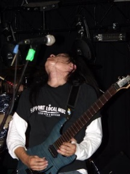

# Abel Wang

## Connect
[Twitter](https://twitter.com/AbelSquidHead) | [LinkedIn](https://linkedin.com/in/abel-wang-9a37694)

## Bio

Abel Wang is a Senior Cloud Developer Advocate specializing in DevOps and Azure with a background in application development.  Before joining Microsoft, Abel spent seven years as a Process Consultant and a Certified Scrum Master helping customers globally develop solutions using agile practices and Team Foundation Server.  Prior to that, Abel founded and sold his own software company.  When not working, Abel is either writing code (yes, that's what he does for fun), playing his guitar or training for The Great Wall Marathon.  https://twitter.com/AbelSquidHead

## Skills

* DevOps

