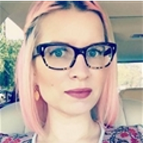

---
title: Ashley McNamara - Cloud Developer Advocate
description: Home page for Ashley McNamara, a Microsoft Cloud Developer Advocate
services: N / A
author: Ashley McNamara
manager: Bryan Liston
ms.topic: article
ms.date: 2017-09-15
ms.author: Ashley McNamara
-- -

# Ashley McNamara

Principal Cloud Developer Advocate

## Connect
[Twitter](https://twitter.com/ashleymcnamara) | [LinkedIn](https://linkedin.com/in/ashleymcnamara1)

## Bio

I've been in the tech industry for almost 20 years, though not always in the most traditional ways. 
At 13 I built my own using spare parts my dad had laying around and I've been a hardware nerd ever since. I have spent my time teaching photoshop workshops, doing business mentoring, building websites, and auditing social media and SEO. I did that for about 10 years, but in 2011, I decided to take this front-end dev thing full time. I took up consulting and got to work with some really cool start-ups and some not so cool enterprises, but in doing so I found myself working with OpenStack. The OpenStack community was rad, and I wanted to contribute so I started with DOCS and after doing that for a while I decided I wanted to do more, so I joined Hackbright as an Engineering Fellow and learned Python. I graduated and was immediately hired by Rackspace. Since then, I've become a huge contributor in the Linux and Go communities and have finally found my happy place as a developer advocate. 
In my spare time, I'm a mentor at WeWork, General Assembly, AngelHack, and CapitalFactory and I�m on the board of multiple engineering groups including Redis Austin, Big Data Analytics Club, and Austin All Girl Hack Night. My passion is helping more underrepresented individuals join and feel comfortable in tech and I'm often a resource for new developers trying to find their way.
https://twitter.com/ashleymcnamara

## Skills

* Linux

## My Projects

* Add some projects here
