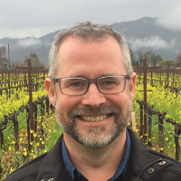

# David Smith

## Connect
[Twitter](https://twitter.com/revodavid) | [LinkedIn](https://linkedin.com/in/dmsmith) | [Github](https://github.com/revodavid)

## About me

I trained as a statistician at the University of Adelaide (Australia) and Lancaster University (UK), but these days I'm a data scientist -- I love the working at the intersection of data analysis, computer science and communications. I've been working with statistical software my entire career: first with S-PLUS, and then with R. Since 2008, I've been writing regularly about R and data science at the [Revolutions blog](http://blog.revolutionanalytics.com/), and I'm a founding member of the [R Consortium](http://www.r-consortium.org/) board of directors.
 
In my personal time, I enjoy relaxing with my husband and our two Jack Russell terriers at home in Chicago. I love movies and pinball, and playing Destiny and Rock Band on the Xbox. I do all I can to support LGBT equality around the world, and I'm a supporter and board member for the [Center on Halsted](http://centeronhalsted.org/) in Chicago.

## Skills

* Statistics
* Data Science
* R

## Come say hi to me

* [Data Day Texas 2018](http://datadaytexas.com/)
* [Rstudio::conf](https://www.rstudio.com/conference/)
* [The Data Science Conference](https://www.thedatascienceconference.com/)
* [R/Finance](http://www.rinfinance.com/)
* [useR!2018](https://user2018.r-project.org/)