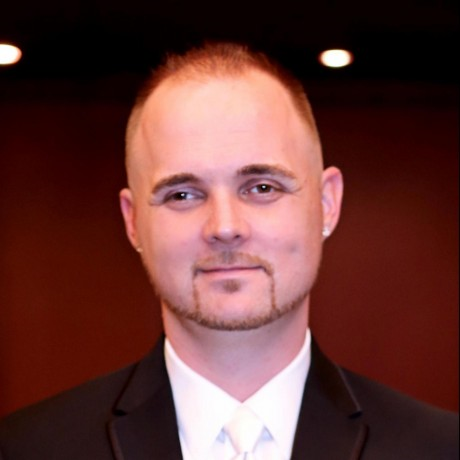

# Erik St. Martin

Principal Cloud Developer Advocate

## Connect
[Twitter](https://twitter.com/erikstmartin) | LinkedIn

## Bio

My curiosity of computers began in my early childhood years playing on a family member's Macintosh SE. I was too young to understand the world of programming then, but it was enough to peak my interest. In my teen years the internet became very popular and I was infatuated with the concept of building my own websites, and like all teenage computer geeks the thrill of "learning to hack". I cut my teeth building my own websites and learned to program by modifying open-source forum software in Perl and PHP, and running my own Counter-Strike servers. Before I knew it I was being offered money to program as a profession. I've been in the open-source and Linux world ever since.

I spent a lot of my early career as a Web Developer at Disney working on their e-commerce platforms in Java and their own internal language and spent the rest of my career moving further and further down the stack as my interests in deeply technical topics, systems programming and distributed computing became a passion. After that, I did a several year stint working for startups building high-scale distributed systems for things like fraud detection, mostly in Ruby and the Go programming language.

The past couple years I've been at Comcast working on Kubernetes, Docker and distributed systems designing and building their linear video streaming platform that provides cable video for millions across the country. It really resonated with my love for high-scale distributed systems and unique challenging problems.

Outside of engineering roles, I've been very passionate about helping educate and build communities around the Go programming language, Kubernetes and Docker. I've contributed to all of these projects, co-authored a book on Go, co-host a podcast about Go and co-organize GopherCon, an annual conference for the Go programming language that attracts 1,500 developers each year.

In my downtime I'm very interested in information security, and teaching myself linux internals, assembly, embedded programming and electronics and have a couple hobby projects like a bbq grill controller I try to sneak time into as I can. [https://twitter.com/erikstmartin](https://twitter.com/erikstmartin)

## My Projects

* Add some projects here
