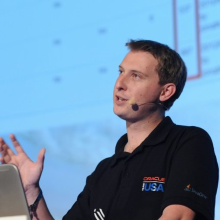

# Jonathan Giles

## Connect
[Twitter](https://twitter.com/JonathanGiles) | [LinkedIn](http://linkedin.com/in/jonathangiles) | [Blog](http://jonathangiles.net) | [GitHub](https://github.com/JonathanGiles) | [StackOverflow](https://stackoverflow.com/users/775663/jonathan-giles)

## About me

I have spent my career focused on Java, and so logically I now work for Microsoft.... :-)

I started as a developer simply using the APIs doing consultancy for clients around New Zealand, and ultimately ended up spending nine years working at Sun Microsystems and Oracle developing the Java platform, for Java releases between Java 7 and Java 10. I consider myself an expert on most things Java, and am a strong advocate for considered, beautiful API design. I have a lot of experience in UI toolkit design and development as I was a technical lead on the JavaFX UI toolkit, where I was responsible for UI controls, CSS engine, the scene graph, FXML, and accessibility.

In addition to this, I'm a JavaOne Rockstar speaker, a Dukes Choice award winner at JavaOne 2017 (for my open source work), a JavaOne track lead (for the user interface / user experience track, including the sessions related to JavaFX and the web), and a technical reviewer for a number of Java-related books.

My role is as a Senior Cloud Developer Advocate at Microsoft, but my focus is on making developers successful however I can. I explore the Azure cloud offering, and try to convey the available functionality in a way that is relevant to Java developers. I am not a salesperson - I am a card-carrying software engineer who wants to solve hard problems. I listen to developers on Stack Overflow, at conferences, or via email - and try my best to offer advice, and always make sure this information is fed back into engineering to ensure everyone succeeds.

I am based in New Zealand with my wife and two children, but I travel to conferences frequently to help grow the Java on Azure ecosystem.

## Skills

* Java
* UI Framework design and implementation
